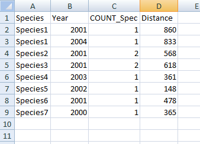

************************
Anatomy of a data search
************************

.. index::
	single: Detailed process description

This section describes how a typical data search might be carried out manually, and how the Data Searches Tool automates this process. Please note that the examples used in this illustration are purely fictional and do not represent a real-world scenario. 

Detailed process description
============================

The process of a typical data search can be broken down into a number of distinct steps that are described here. In the next section the way that the Data Searches Tool carries out these steps is explained.

**Entering a search location**

Before any search can be carried out, the point, line or polygon describing the location that the search is centred on has to be entered into the GIS system. Typically this would be held in a single data layer, with some associated attributes such as the search reference or the name of the search site.

**Buffering the search site**

Once the search location is entered into the GIS system, it can be used as input into a buffering tool. The user chooses the radius within which the search will be carried out, and buffers the search location using this search radius. The output from this operation is saved as a new GIS data layer.

**Selecting the relevant data layers**

Using the buffer layer created in the previous step, each of the data layers describing the presence of protected sites and/or species is selected one by one.

**Exporting the results**

The selected features are exported in the format required by the user. This can include both GIS data layers to allow mapping and visualisation, and tabular data for reporting purposes. Labels may be added to the GIS data at this point to aid in the identification of individual sites on any maps that are created. Other columns may need to be added or removed from the tabular data at this point to create the exact output the user requires. If a summary table of the results is needed for the search report, the user has to create this by hand from the exported tables using a spreadsheet or word processing package.

**Repeating the process**

For statutory reasons the search radius may vary between (for example) protected sites and protected species. In this case the search needs to be repeated with a new buffer layer.

.. index::
	single: Tool overview

The Data Searches Tool
======================

There are four parts to the Data Searches Tool that work together to automate the process described above:

1. An Access database that contains details about search requests, including a unique search reference number.
#. One or more GIS layers that describe the locations of the searches, using the same unique search reference number to identify each search request.
#. An XML file that specifies how the searches are set up and what data should be exported for each data layer
#. The Data Searches Tool interface.

The Data Searches Tool is used within a GIS environment and requires all the required data layers to be preloaded in the GIS (see :numref:`figArcGISUI`). 

.. _figArcGISUI:

	The ArcGIS user interface configured for using the Data Searches Tool

Tool workflow
-------------

The Data Searches Tool requires minimum user input in order to carry out its processes once it is configured. The simple workflow is as follows (see :numref:`figUIAnn`):

1. The user enters the unique search reference. At this point, the tool retrieves the site name for this search from the Access database.
#. If no name was found, the user may enter the site name.
#. The user specifies which data layers to search. Only layers that are loaded in the GIS are made available at this point.
#. A buffer size is entered and the units for this buffer are specified.
#. The user chooses whether to add any selected GIS layers to the map, and whether (and how) this new data should be labelled. 
#. Finally, the user selects whether a table combining all the results should be created during the process, and whether the log file should be cleared before the process starts. 
#. Once the user clicks 'OK' the process starts.

.. _figUIAnn:

.. figure:: figures/MenuExampleAnnotated.png
	:align: center

	The Data Searches Tool menu workflow

In essence, the process that the tool follows is identical to the manual search described above. 

1. Firstly the search reference is located in the the data layer(s) containing the search location.
#. The location is buffered using the specified radius, resulting in a new data layer that is saved in the output folder.
#. Selections are made on all data layers specified by the user using this buffer layer.
#. The resulting selections are exported to the output folder as specified in the configuration file. At this point, columns may be automatically added, removed or changed, labels may be added to the output and summary data can be calculated. Output can be saved as tabular data only, or as both tabular and GIS data.
#. If required the output is also added to a summary 'combined sites' table to aid reporting.
#. GIS data is added to the map as detailed by the user. Layers are symbolised as specified in the configuration file, and labels are added if requested.
#. During the process the tool reports its progress to a log file and when the process finishes this log file is displayed, allowing the user to assess the success of the data search. The log file is kept with the other output in the output directory.

.. index::
	single: Tool Outputs

Tool Outputs
============

Below is a selection of outputs generated from the example data search given in figures :numref:`figArcGISUI` and :numref:`figUIAnn`. These examples were generated using the ArcGIS tool, and the GIS output from the MapInfo tool has a slightly different format. The tabular data, however, is the same for both implementations of the tool [Andy you might want to include the visuals from the MapInfo implementation].

When the process finishes, the GIS output is presented within the GIS interface (:numref:`figArcOutputAnn`). Note the output layers are presented in a logical format and their names refer back to the search reference number. The symbology of the layers is customised, as is the labelling applied to each output layer. The buffer that was used for the analysis is also included in the output. Only layers for which a feature was found within the search radius will be included in the output.

.. _figArcOutputAnn:

	GIS output from the Data Searches Tool (ArcGIS implementation)

The GIS output is stored, together with all other outputs from the tool, in a user defined folder (:numref:`figOutputFolder`). These outputs may include a combination of GIS layers, the buffer layer that was used, tabular layers in different formats, a combined sites table, and the log file.  

.. _figOutputFolder:

	Data Searches Tool output folder

Tabular output is produced in a text based format and can include the distance of each feature to the search feature (:numref:`figTabularOutput`). It is possible to create summary statistics for any column during the process, which will be included in the tabular output.

.. _figTabularOutput:

	Example of tabular output from the Data Searches Tool

The combined sites table (see :numref:`figCombinedSites`) contains a summary of the sites that are found. Again, this output is highly customisable and it is easy to exclude or include layers in this table as required. Any summary statistics can be included.

.. _figCombinedSites:

.. figure:: figures/CombinedSitesTableExample.png
	:align: center

	Example of a combined sites table

Finally, the log file details each step that was taken during the process, and gives some feedback about the outcomes of the steps. This includes reporting on the input for the search, the number of features that were selected in each data layer, and which data layers did not return any features (see :numref:`figLogFile`).

.. _figLogFile:

.. figure:: figures/LogFileExample.png
	:align: center

	Example of a Data Searches Tool log file

The following chapters, :doc:`setting up the tool <../setup/setup>` and :doc:`using the tool <../execute/execute>`, will guide you through setting up and operating the tool in such a way that these tool outputs meet the exact requirements of data searches within your organisation.