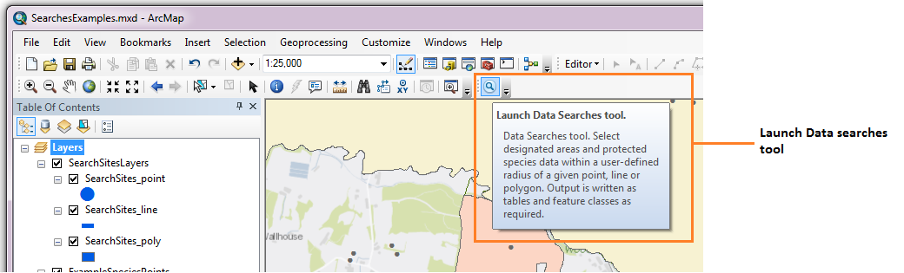
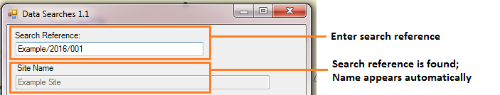
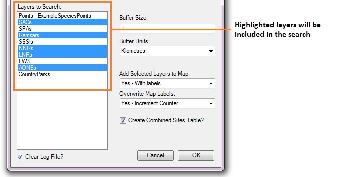

****************
Running the tool
****************

The operation of the Data Searches tool is explained in this section. While the interface is similar between the ArcGIS and MapInfo implementations of the tool, there are some differences. These are pointed out where relevant throughout this document.

As discussed in the :doc:`Setting up the tool <../setup/setup>` section, the Data Searches tool is operated from a GIS project file within which the data required to run the tool is already loaded. It also relies on an Access database with details about the searches, and a configuration document. Therefore, before running the tool, ensure the following conditions are met:

- A GIS document has been created which contains both the search sites layer(s) and the data layers describing protected sites and species that will be queried, as required. 
- An Access database exists that contains the relevant information about the searches, in the correct tables and formats.
- The search sites layer(s) have a column that contains the unique reference for each search, and this reference has the correct format.
- The XML configuration document has been set up correctly, both for general settings and for each individual layer that will be queried. It is named correctly.
- The Data Searches tool has been installed and set up.

Please refer to the :doc:`setup <../setup/setup>` section for further information about any of these requirements.

Opening the form
----------------

To open the Data Searches tool, click on the Data Searches tool button (ArcGIS; see :numref:`figLaunchArcGIS`), or open the tool in the Tools menu (MapInfo). 

.. _figLaunchArcGIS:

	Launching the Data Searches tool (ArcGIS).

If there are any structural issues with the XML document, the tool will display a message with the error it has encountered and not load any further. If any of the map layers that are listed in the configuration document are not present, a warning will be shown (:numref:`figLaunchWarning`). The layers that are missing will not be loaded into the form and so cannot be included in the analysis. Provided that the XML document is otherwise correct, the form will display (:numref:`figDisplayForm`).

.. _figLaunchWarning:

.. figure:: figures/LaunchWarningArcGIS.png
	:align: center

	A warning is displayed for any data layers not loaded in the GIS project.

.. _figDisplayform:

.. figure:: figures/DisplayFormArcGIS.png
	:align: center

	The form is displayed with the available data layers shown.

Enter the search reference in the Search Reference box. If the search reference exists in the linked Access database, the site name will be displayed in the Site Name box (:numref:`figSearchRefKnown`). If it does not exist, but you are certain the search reference exists in the search layer(s), enter the site name by hand (:numref:`figSearchRefUnknown`).

.. _figSearchRefKnown:

	Site name displays automatically if the search reference is found in the Access database.

.. _figsearchRefUnknown:

.. figure:: figures/SearchReferenceUknown.png
	:align: center

	Site name can be filled in by hand if the search reference is not found in the Access database.

Now select the data layers you wish to search in the 'Layers to Search' box. Use <ctrl> to select individual layers, or <shift> to select a range of layers. Selected layers are shown in blue, layers that will not be included remain white (:numref:`figSelectLayers`).

.. _figSelectLayers:

	Select the layers you wish to search.

- Slight differences for MI / AG
- Worked example(s)
- Creating a project with pre-loaded layers
- Note: overwrite of outputs
- Why is this happening (reporting tool – only likely to be the combined sites table unless using same layer at different buffer distances)
- What to do about it (e.g. split the search into two; save into different subdirectories)
