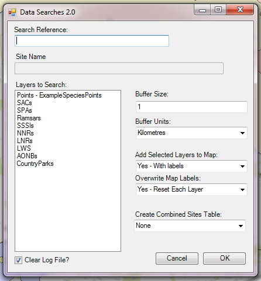
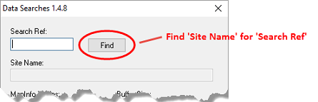
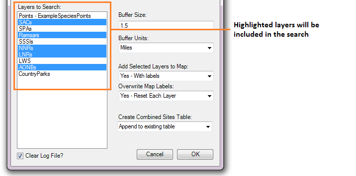
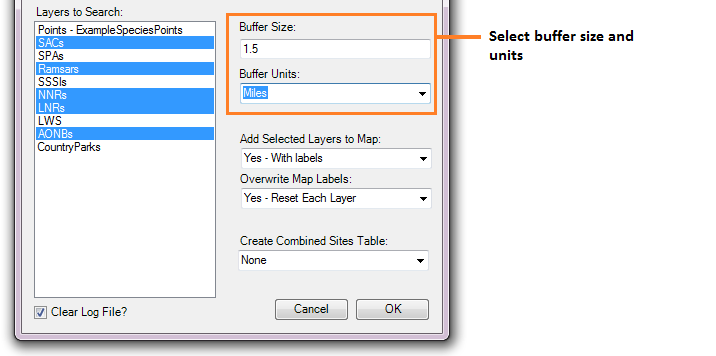
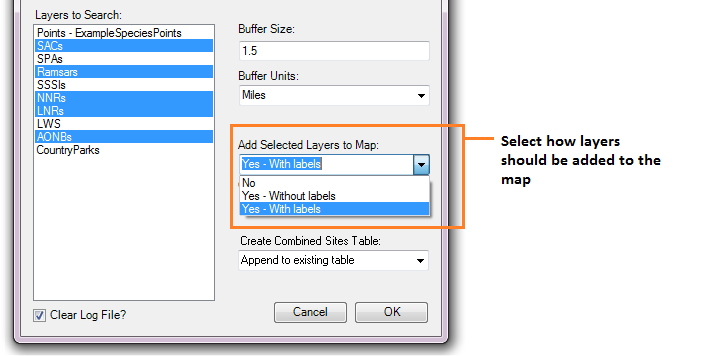

.. index::
	single: Running the tool

****************
Running the tool
****************

The operation of the Data Searches tool is explained in this section. While the interface is similar between the ArcGIS and MapInfo implementations of the tool, there are some differences. These are pointed out where relevant throughout this document.

As discussed in the :doc:`Setting up the tool <../setup/setup>` section, the Data Searches tool is operated from a GIS project file within which the data required to run the tool is already loaded. It also relies on an Access database with details about the searches, and a configuration document. Therefore, before running the tool, ensure the following conditions are met:

- A GIS document has been created which contains both the search sites layer(s) and the data layers describing protected sites and species that will be queried, as required. 
- An Access database exists that contains the relevant information about the searches, in the correct tables and formats.
- The search sites layer(s) have a column that contains the unique reference for each search, and this reference has the correct format.
- The XML configuration document has been set up correctly, both for general settings and for each individual layer that will be queried. It is named correctly.
- The Data Searches tool has been installed and set up.

.. seealso::
	Please refer to the :doc:`setup <../setup/setup>` section for further information about any of these requirements.

.. raw:: latex

   \newpage

.. index::
	single: Opening the form

Opening the form
----------------

To open the Data Searches tool in ArcGIS, click on the :kbd:`Data Searches` tool button (:numref:`figLaunchArcGIS`).

.. _figLaunchArcGIS:

	Launching the Data Searches tool (ArcGIS)

To open the Data Searches tool in MapInfo, select **Tools... -> Data Extractor** in the `Tools` menu (:numref:`figLaunchMapInfo`).

.. _figLaunchMapInfo:

	Launching the Data Searches tool (MapInfo)

If there are any structural issues with the XML document, the tool will display a message with the error it has encountered, and not load any further. If any of the map layers that are listed in the configuration document are not present in the active ArcGIS document or MapInfo workspace, a warning will be shown (:numref:`figLaunchWarningArcGIS`). The layers that are missing will not be loaded into the form and so cannot be included in the search process.

.. _figLaunchWarningArcGIS:

	Warning message displayed for any data layers not loaded

.. raw:: latex

   \newpage

Provided that the XML document is otherwise correct, the form will display (:numref:`figDisplayFormArcGIS`).

.. _figDisplayformArcGIS:

	The form displaying the available data layers (ArcGIS)

.. note::
	The MapInfo version of the form has an additional button after the `Search Reference` field (:numref:`figSearchRefButtonMapInfo`) to retrieve the Site Name.

.. _figSearchRefButtonMapInfo:

	The additional search reference button (MapInfo)

.. raw:: latex

   \newpage

.. index::
	single: Using the form

Using the form
--------------

Enter the search reference in the Search Reference box. If the search reference exists in the linked Access database, the site name will be displayed in the Site Name box (:numref:`figSearchRefKnownArcGIS`). If it does not exist, but you are certain the search reference exists in the search layer(s), enter the site name by hand (:numref:`figSearchRefUnknownArcGIS`).

.. _figSearchRefKnownArcGIS:

	Site name displays automatically if the search reference is found

.. _figsearchRefUnknownArcGIS:

	Site name can be filled in manually if the search reference is not found

.. note::
	The MapInfo version of the form has an additional button after the `Search Reference` field (:numref:`figSearchRefButtonMapInfo`). This must be clicked to check if the search reference exists in the linked Access database and display the site name in the Site Name box.

.. raw:: latex

   \newpage

Now select the data layers you wish to include in the search in the 'Layers to Search' list (ArcGIS) or 'MapInfo Tables' list (MapInfo). Use the :kbd:`Ctrl` key to select individual layers, or the :kbd:`Shift` key to select a range of layers. Selected layers will appear highlighted, layers that will not be included remain unselected (:numref:`figSelectLayersArcGIS`).

.. _figSelectLayersArcGIS:

	Select the layers to include in the search

Next, select the buffer size and units in the Buffer Size and Buffer Units boxes (:numref:`figBufferSettingsArcGIS`). The buffer size box accepts decimal points. A buffer size of zero (0) is acceptable, however in ArcGIS the tool will create a buffer polygon of 0.01 metres if a zero buffer size is specified, in order for the buffer layer to be symbolised correctly.

.. _figBufferSettingsArcGIS:

	Select the buffer size and units you wish the search to use.

Decide whether you wish to add the results of the search to the screen and select the relevant option in the Add Selected Layers to Map dropdown box. There are three options (:numref:`figLayerSettingsArcGIS`):

- No. Layers will not be added to the map.
- Yes - Without labels. Layers will be added to the map but will not be labelled.
- Yes - With labels. Layers will be added to the map and will be labelled.

When either of the 'Yes' options is selected, layers will be added to the map in accordance with the settings that are given for each map layer in the configuration document. 

.. note:: 
	If the `KeepLayer <../setup/setup.html#keeplayer>`__ attribute is set to ``no`` for an individual layer, it will not be added to the map even if the user selects a 'Yes' option in the drop-down list.

If you have selected 'Yes - With labels', select how labels should be added in the 'Overwrite Map Labels' dropdown box (:numref:`figLabelSettingsArcGIS`). If you have made a different selection in the Add Selected Layers to Map dropdown box, any settings in the 'Overwrite Map Labels' will be ignored. [Andy I have disabled this drop-down box in ArcGIS in this instance. I assume MapInfo won't support that?] There are three options: 

- No. Existing map labels will not be overwritten. However, new map labels will be created if the map label column given in the configuration document doesn't exist. In this case the labels will be numbered from 1 and increase incrementally for each feature. This counter will increment continuously for any other layers for which the given map label column does not exist (i.e. the counter will not reset to zero for each new layer).
- Yes -  Reset Counter. 
- Yes - Increment Counter

.. note::
	Map layers will be labelled in accordance with the settings that are given for each map layer in the configuration document. These settings can override the above options in the following circumstances:

	- If no `LabelColumn <../setup/setup.html#labelcolumn>`__ is given in the configuration file, the map layer will not be labelled in any circumstance.
	- If the `OverwriteLabels <../setup/setup.html#overwritelabels>`__ attribute is set to ``no``, the labels for this map layer will not be overwritten even if requested by the user.

.. note::
	If no default values have been given in the XML file for `DefaultAddSelectedLayers <..setup/setup.html#defaultaddselectedlayers>`_, `DefaultOverwriteLabels <..setup/setup.html#defaultoverwritelabels>`_ or `DefaultCombinedSitesTable <..setup/setup.html#defaultcombinedsitestable>`_, the drop-downs relating to these options will **not show on the form**. In this case, no layers will be added, no labels overwritten, and no combined sites table created, respectively.

.. _figLayerSettingsArcGIS:

	Select how results should be added to the map, if at all.

.. _figLabelSettingsArcGIS:

	Select how labels should be added to the map, if at all.

Finally, select whether a combined sites table should be created by checking or unchecking the 'Create Combined Sites Table' check-box, and whether the log file should be cleared before the analysis by checking or unchecking the 'Clear Log File' check-box (:numref:`figCheckBoxesArcGIS`). Click 'OK' for the analysis to start.

.. _figCheckBoxesArcGIS:

.. figure:: figures/CheckBoxesArcGIS.png
	:align: center

	Select options for the combined sites table and log file.

.. index::
	single: Analysis results

Analysis Results
----------------

While the data searches tool is running the analysis, the map interface will become inactive. In ArcGIS, the screen will show 'Paused'. Once the analysis is finished the interface will reactivate.

When the analysis is finished, a message box will appear (:numref:`figFinishedArcGIS`). If you would like to rerun the analysis (for example, for different data layers, or for a different buffer size), choose to keep the form open and it will retain the information as it was entered for the current analysis. Once you have made your choice, the log file will be shown using Notepad (:numref:`figLogFileArcGIS`). Using this you can review whether the search was carried out as expected. When you are finished, close the log file. It has already been saved in the analysis folder for future reference.

.. _figFinishedArcGIS:

	Once the process finishes a message box is shown.

.. _figLogFileArcGIS:

	The log file is shown for review.

In the map interface, the results of the analysis are added as requested. 

In ArcGIS, the results are added to a new group layer of which the name format follows the short search reference, with any special characters replaced with the `RepChar <../setup/setup.html#repchar>`__ given in the XML document. Where requested in the configuration (using the `LayerFile <../setup/setup.html#layerfile>`__ attribute), symbology is applied to each result layer using layer files. Unless the buffer radius specified is zero, the system will zoom to the extent of the buffer that has been created during the search. 

An example result map for ArcGIS is shown in :numref:`figResultsArcGIS`. Note that only results for those layers for which features were found within the search radius were added.

.. _figResultsArcGIS:

	The results are added to the map (ArcGIS).

[MapInfo version here]

All exported data tables, GIS layers and the log file are kept in the `GISFolder <../setup/setup.html#gisfolder>`__ as specified in the XML document. 

Now you can repeat the analysis as required. 

.. _OverwriteWarning:

.. warning:: 
	When you rerun the analysis using the **same search reference**, for example with a different buffer size, it is likely that certain outputs are overwritten:

	- The combined sites table will be overwritten for every repeat of a search using the same reference.
	- Output tables and GIS output will be overwritten if the same map layer is included in a second search.

	The reason for this is that the Reporting tool [Andy do you have a reference?], which can be run on the results of the data search, has certain requirements. The easiest way to resolve this issue is by moving the results of the first search to a different folder, e.g. one containing the buffer size in the name. At this version it is not possible to do this automatically. 
