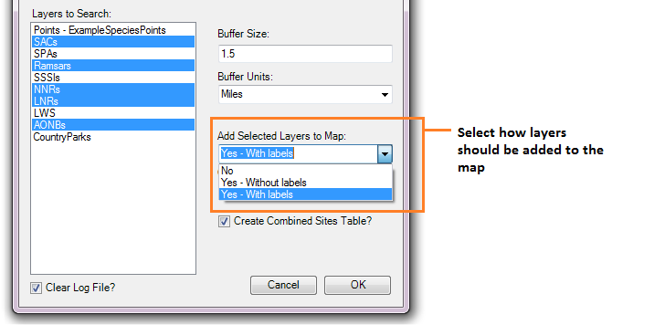
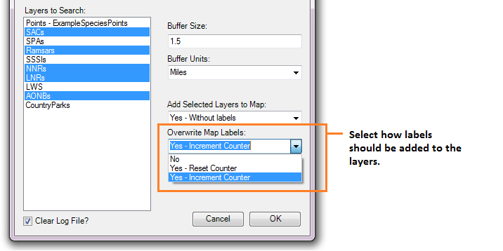

****************
Running the tool
****************

The operation of the Data Searches tool is explained in this section. While the interface is similar between the ArcGIS and MapInfo implementations of the tool, there are some differences. These are pointed out where relevant throughout this document.

As discussed in the :doc:`Setting up the tool <../setup/setup>` section, the Data Searches tool is operated from a GIS project file within which the data required to run the tool is already loaded. It also relies on an Access database with details about the searches, and a configuration document. Therefore, before running the tool, ensure the following conditions are met:

- A GIS document has been created which contains both the search sites layer(s) and the data layers describing protected sites and species that will be queried, as required. 
- An Access database exists that contains the relevant information about the searches, in the correct tables and formats.
- The search sites layer(s) have a column that contains the unique reference for each search, and this reference has the correct format.
- The XML configuration document has been set up correctly, both for general settings and for each individual layer that will be queried. It is named correctly.
- The Data Searches tool has been installed and set up.

Please refer to the :doc:`setup <../setup/setup>` section for further information about any of these requirements.

Opening the form
----------------

To open the Data Searches tool, click on the Data Searches tool button (ArcGIS; see :numref:`figLaunchArcGIS`), or open the tool in the Tools menu (MapInfo). 

.. _figLaunchArcGIS:

.. figure:: figures/LaunchSearchesTool.png
	:align: center

	Launching the Data Searches tool (ArcGIS).

If there are any structural issues with the XML document, the tool will display a message with the error it has encountered and not load any further. If any of the map layers that are listed in the configuration document are not present, a warning will be shown (:numref:`figLaunchWarning`). The layers that are missing will not be loaded into the form and so cannot be included in the analysis. Provided that the XML document is otherwise correct, the form will display (:numref:`figDisplayForm`).

.. _figLaunchWarning:

.. figure:: figures/LaunchWarningArcGIS.png
	:align: center

	A warning is displayed for any data layers not loaded in the GIS project.

.. _figDisplayform:

.. figure:: figures/DisplayFormArcGIS.png
	:align: center

	The form is displayed with the available data layers shown.

Enter the search reference in the Search Reference box. If the search reference exists in the linked Access database, the site name will be displayed in the Site Name box (:numref:`figSearchRefKnown`). If it does not exist, but you are certain the search reference exists in the search layer(s), enter the site name by hand (:numref:`figSearchRefUnknown`).

Filling in the form
-------------------

.. _figSearchRefKnown:

	Site name displays automatically if the search reference is found in the Access database.

.. _figsearchRefUnknown:

	Site name can be filled in by hand if the search reference is not found in the Access database.

Now select the data layers you wish to search in the 'Layers to Search' box. Use <ctrl> to select individual layers, or <shift> to select a range of layers. Selected layers will appear highlighted, layers that will not be included remain white (:numref:`figSelectLayers`).

.. _figSelectLayers:

.. figure:: figures/SelectLayers.png
	:align: center

	Select the layers you wish to search.

Next, select the buffer size and units in the Buffer Size and Buffer Units boxes (:numref:`figBufferSettings`). The buffer size box accepts decimal points. A buffer size of zero (0) is acceptable, however in ArcGIS the tool will create a buffer polygon of 0.01 metres if a zero buffer size is specified, in order for the buffer layer to be symbolised correctly.

.. _figBufferSettings:

	Select the buffer size and units you wish the search to use.

Decide whether you wish to add the results of the search to the screen and select the relevant option in the Add Selected Layers to Map dropdown box. There are three options (:numref:`figLayerSettings`):

- No. Layers will not be added to the map.
- Yes - Without labels. Layers will be added to the map but will not be labelled.
- Yes - With labels. Layers will be added to the map and will be labelled.

When either of the 'Yes' options is selected, layers will be added to the map in accordance with the settings that are given for each map layer in the configuration document. 

.. note:: 
	If the `KeepLayer`_ attribute is set to ``no`` for an individual layer, it will not be added to the map even if the user selects a 'Yes' option in the dropdown list.

If you have selected 'Yes - With labels', select how labels should be added in the 'Overwrite Map Labels' dropdown box (:numref:`figLabelSettings`). If you have made a different selection in the Add Selected Layers to Map dropdown box, any settings in the 'Overwrite Map Labels' will be ignored. There are three options: 

- No. Existing map labels will not be overwritten. However, new map labels will be created if the map label column given in the configuration document doesn't exist. In this case the labels will be numbered from 1 and increase incrementally for each feature. This counter will increment continuously for any other layers for which the given map label column does not exist (i.e. the counter will not reset to zero for each new layer).
- Yes -  Reset Counter. 
- Yes - Increment Counter

.. note::
	Map layers will be labelled in accordance with the settings that are given for each map layer in the configuration document. These settings can override the above options in the following circumstances:

	- If no `LabelColumn`_ is given in the configuration file, the map layer will not be labelled in any circumstance.
	- If the `OverwriteLabels`_ attribute is set to ``no``, the labels for this map layer will not be overwritten even if requested by the user.

.. _figLayerSettings:

	Select how results should be added to the map, if at all.

.. _figLabelSettings:

	Select how labels should be added to the map, if at all.

Finally, select whether a combined sites table should be created by checking or unchecking the 'Create Combined Sites Table' checkbox, and whether the log file should be cleared before the analysis by checking or unchecking the 'Clear Log File' checkbox (:numref:`figCheckBoxes`). Click 'OK' for the analysis to start.

.. _figCheckBoxes:

.. figure:: figures/Checkboxes.png
	:align: center

	Select options for the combined sites table and log file.

	

- Slight differences for MI / AG
- Worked example(s)
- Creating a project with pre-loaded layers
- Note: overwrite of outputs
- Why is this happening (reporting tool – only likely to be the combined sites table unless using same layer at different buffer distances)
- What to do about it (e.g. split the search into two; save into different subdirectories)
