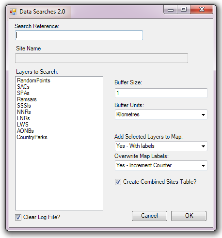

************
Introduction
************

.. index::
	single: Background

Background
==========

Carrying out data searches (i.e. establishing which protected areas or species are present within a set radius of a proposed development) is a routine task for Local Environmental Record Centres (LERCs). The process is a repetitive one, with the same kind of search being carried out each time a search request is received. The requirements for the search are defined by legislation, and the outputs generated for the searches are generally in the same format. Therefore, this is a process that is ideally suited to being automated.

The Data Searches tool was originally developed for Greenspace Information for Greater London (GiGL) and implemented in MapInfo. Currently the tool is used by a variety of LERCs and is available as a MapInfo tool as well as an ArcGIS add-in.

.. raw:: latex

   \newpage

.. index::
	single: Tool overview

Tool overview
=============

The Data Searches tool presents a simple user interface, while being configurable in a highly flexible way according to the requirements of the LERC or individual user. It is integrated into the user interface of the GIS system and presented there as a button or menu item. The tool itself has a simple interface (:numref:`figUI`), requiring a minimum of input (a reference to a search request, the data layers to be included in the search, and the radius to be used in the search are the only required items). 

.. _figUI:

	The Data Searches tool interface

When running a search, the tool uses an existing GIS layer in the interface to find the geographical location of the  search request reference, and a linked Microsoft Access database to obtain some information about the search reference. It then queries pre-loaded data layers to establish which have features within the specified radius of the location, and exports this information in a format requested by the user. The output data is tabular and an option exists to export the associated GIS data at the same time. The tool creates a log file for each search which details the steps that were taken during the process. The process is discussed in this document in the section on :doc:`using the tool <../execute/execute>`.

Defining the way that searches should be carried out, the output that they generate, and the layers that can potentially be included in a search is done via a configuration document written in XML. Using this document the user can configure all the parts of the search, for example:

* The name of the geographic layer containing the search references, and its key columns.
* The location of the Access database and its name.
* The location of the output folder.
* Naming conventions for output files and folders, e.g. how the search reference or site name should be included.
* Defaults for buffer sizes and buffer units.
* For each data layer, a detailed definition of what information should be returned from it.
* Details on the display and labelling of output from individual data layers.

Using this configuration file, each individual LERC can tailor the Data Searches tool to its individual requirements in great detail. Examples of the XML file are included in the :doc:`../appendix/appendix`, and the process of setting up this file is discussed in the section on :doc:`setting up the tool <../setup/setup>`. 

.. index::
	single: Benefits

Benefits
========

There are a number of clear benefits to using the Data Searches tool for carrying out routine data searches. 

1. The tool, by encapsulating and automating the process, saves considerable time over carrying out these searches manually.
#. Both the process and the outputs of the search are standardised, therefore minimising the risk of user error that is present in a manual search.
#. Using the tool makes exploration easy, as it allows for the rapid evaluation of 'what if' scenarios (e.g. by varying the search radius, or exploring a number of possible locations).
#. By specifying the outputs of the tool centrally through the configuration file, the output for each search is consistent with all other searches, regardless of the individual carrying out the search. This leads to comparability of results and a predictable experience for the users of a data search service.
#. The searches are repeatable and, through the inclusion of the log file, automatically documented.