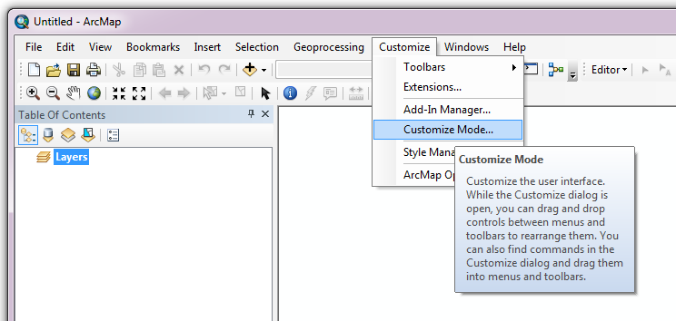

*******************
Setting up the tool
*******************

Before the Data Searches Tool will function, it needs to be installed and configured. It is recommended that the configuration is carried out first, although the steps are interchangeable for the ArcGIS implementation. 

.. index::
	single: Configuring the tool

Configuring the tool
====================

The configuration is stored in an XML file called 'DataSearches.xml', and there are some differences in the contents of this file between the MapInfo and the ArcGIS implementations of the tool. Please ensure that you are using the correct XML file, examples of both of which can be found in the :doc:`appendix <../appendix/appendix>`. Attributes and settings are presented as nodes (beginning with a start node, e.g. ``<example>``, and finishing with an end note, e.g. ``<\example>``), with the value for the setting held between the ``<value>`` and ``<\value>`` tag. 

.. note:: 
	The name of the configuration file must be 'DataSearches.xml'. The tool will not load if a different name is used.

The XML file can be edited in a text editor such as Notepad or Wordpad, or using a more feature rich XML editor such as as `Sublime Text <https://www.sublimetext.com/3>`_. The configuration file is split into two sections: a section containing general attributes of the searches, and a section that deals with the way each data layer should be handled. This structure is the same for both implementations of the tool. 

.. note::
	It is important that the structure of the file is maintained as it is presented in the :doc:`appendix <../appendix/appendix>`. Any changes to the structure may result in the Data Searches Tool not loading, or not working as expected.

Once editing has been completed and the edits have been saved, it is recommended that the configuration file is opened using an internet browser such as Internet Explorer which will help highlight any editing errors – only if the structure of the file is valid will the whole file be displayed in the internet browser.

.. note::
	It is recommended that the configuration file is kept in a central (network) location, so that all data searches use the same setup. In case of the MapInfo implementation of the tool, it is essential that the configuration file is kept in the same folder as the compiled version of the tool.

.. index::
	single: Setup for ArcGIS

Setup for ArcGIS
----------------

.. index::
	single: General attributes for ArcGIS

**General attributes**

The first section of the configuration file deals with a series of general attributes for the Data Searches tool. These general nodes specify where files are kept, how output files should be named and other overall settings. Details on these attributes and their expected values are given below. The list follows the order within which the attributes are found in the configuration file. This version of the configuration details is valid for version 1.2 of the Data Searches Tool.

.. note::
	The enquiry reference takes the form 'LERCName/Year/EnquiryNumber' (e.g. 'Example/2016/001'). Within the configuration file, it is possible to use all or parts of this reference for naming files and folders. The following options are available:

	- ``%ref%`` uses the full enquiry reference.
	- ``%shortref%`` uses the numeric part of the reference (e.g. '2016/001').
	- ``%subref%`` uses the Enquiry Number (e.g. '001').
	- ``%sitename%`` uses the name of the site (e.g. 'Example site').

_`Database` 	
	The path to the Access database that contains the details of all search requests. This must be the full path including the ``.mdb`` extension. The database must have a table called 'Enquiries' that contains, at the very least, the search reference and the site name.

_`RefColumn`
	The name of the column in the Enquiries table within the Access database that contains the search reference. The name must be given without any brackets. The search reference must follow the format 'LERCName/Year/EnquiryNumber'.

_`SiteColumn`
	The name of the column in the Enquiries table within the Access database, that contains the site name. The name must ge given without any brackets.

_`RepChar`
	The character(s) used to replace any special characters in file or folder names. 'Special' characters are any of the following: ``\, %,$, :, *, /, ?, <, >, |, ~, £, .``. The replacement character can itself not be a special character.

_`LayerFolder`
	The folder where layer files (``.lyr``) are kept. These files are used to symbolise the GIS data layers that are exported during processing.

_`SaveRootDir`
	The folder within which all output folders will be created.
 
_`SaveFolder`
	The name of the folder that will be created for each search. The keywords ``%ref%``, ``%shortref%``, ``%subref%``and ``%sitename%`` are allowed.

_`GISFolder`
	The name of the folder where all data generated by the Data Searches Tool will be stored. This folder will be created in the `SaveFolder`_. The keywords ``%ref%``, ``%shortref%``, ``%subref%`` and ``%sitename%`` are allowed.

_`LogFileName`
	The name of the log file that will be created during processing. TThe keywords ``%ref%``, ``%shortref%``, ``%subref%``and ``%sitename%`` are allowed.

_`DefaultClearLogFile`
	Yes/No attribute, defining whether the check box for 'Clear Log File?' on the interface should be set to checked (``yes``) or unchecked (``no``) when the form is opened.

_`DefaultBufferSize`
	The default buffer size that will appear in the 'Buffer Size' text box when the form is opened.

_`BufferUnitOptions`
	The options for buffer units that will be shown in the 'Buffer Unit' dropdown list. It is not recommended that these are changed. However, details of how any changes should be formatted are in the comments for this attribute within the XML file.

_`DefaultBufferUnit`
	The buffer unit that should be shown by default in the 'Buffer Unit' dropdown list. This attribute is the index number of the unit in the dropdown list, with 1 being the first option.

_`BufferLayerName`
	The name of the layer file (kept in the `LayerFolder`_) which will be used to symbolise the buffer layer. Must include the ``.lyr`` extension.

_`SearchLayer`
	The name of the data searches GIS layer in the interface. There may be either a single search layer (of either points, polygons or lines) of this name, or there may be multiple search layers present (e.g. one of each format) in which case their names should begin with the SearchLayer entry. See :numref:`figArcGISUI` for an example. In the case of this example, the entry for this node was ``SearchSites`` and the `SearchLayerExtensions`_ entry (see next attribute) was ``_point;_poly;_line``. 

_`SearchLayerExtensions`
	If multiple search layers are used, this node should contain a list of the extensions for each layer, delimited by semicolons (e.g. in the example used above, the entry was ``_point;_poly;_line``). If only a single layer is used this attribute should be left blank.

_`SearchColumn`
	The name of the column in the search layer(s) that holds the search reference.

_`AggregateColumns`
	A list, delimited by semicolons, of the fields in the search layer that should be used to dissolve the buffer during processing. This attribute can be used in cases where the search sites are multi-part features which may create a number of overlapping buffers rather than one continuous one.

_`AddSelectedLayersOptions`
	The options that should be shown in the 'Add Selected layers to Map' dropdown list. These options should not be changed.

_`DefaultAddSelectedLayers`
	The default option for adding the selected layers that should be shown when the form opens. This attribute is the index number of the item in the 'Add Selected Layers to Map' dropdown list, with 1 being the first option. If no value is entered the list box will be hidden and no layers will be added to the map.

_`OverwriteLabelOptions`
	The options that should be shown in the 'Overwrite Map Labels' dropdown list. These options should not be changed.

_`DefaultOverwriteLabels`
	The default option for the 'Overwrite Map Labels' dropdown that should be shown when the form opens. This attribute is the index number of the item in the dropdown list, with 1 being the first option. If no value is entered the list box will be hidden and labels will not be overwritten.

_`CombinedSitesTableOptions`
	The options that should be shown in the 'Create Combined Sites Table' dropdown list. These options should not be changed.

_`DefaultCombinedSitesTable`
	The default option for the 'Create Combined Sites Table' dropdown that should be shown when the form opens. This attribute is the index number of the item in the dropdown list, with 1 being the first option. If no value is entered the list box will be hidden and no combined sites table will be created.

_`CombinedSitesTable`
	This section defines the combined sites table. It has the following entries:

	Columns
		A comma-delimited list of the column headings that the combined sites table should have.
	Suffix
		An entry of what the suffix of the file name should be. The name of the combined sites table is given by ``subref_Suffix.Format``, e.g. ``001_sites.csv`` where the suffix is ``sites`` and the format is ``csv``. The use of the ``subref`` keyword is predefined in this case and cannot be changed.
	Format
		The format that the combined sites table should have. Choose from ``csv`` or ``txt``.

.. index::
	single: Map layer attributes for ArcGIS

**Map layer attributes**

All map layer attributes are found within the ``<MapLayers>`` node. For each data layer that can be included in the searches, a new child node is created that has the name of the layer (e.g. ``<SSSIs>``). This name is name of the layer as it will be shown in the tool menu, and can be different from the layer name as it is shown in the ArcGIS table of contents (which will be set in a subsequent child node). A simple example of a map layer definition with limited attributes is shown in :numref:`figArcGISUI`. 

.. note::
	If you wish to display spaces in any layer names in the tool menu use an underscore (``_``) for each space in the node name for the layer. XML does not allow spaces in node names, but the tool will translate these underscores into spaces when the form is opened.

.. _figXMLExample:

.. figure:: figures/DataLayerXMLExample.png
	:align: center

	A simplified example of how data layer attributes are stored in the configuration file. 

The attributes that are required for each map layer are as follows:

_`LayerName`
	The name of the layer as it is shown in the GIS interface. Characters that cannot be included in the layer name are ``/`` and ``&`` as they will cause the tool to fail. The characters ``-``, ``_``, ``+`` and ``\`` are permitted.

_`Prefix`
	The prefix will be used to start the name of any GIS layer that is exported from this data layer during the search. The naming followed for exported GIS layers is ``Prefix_subref.shp``, e.g. ``SSSIs_001.shp``. The use of the ``subref`` keyword in this case is predefined and cannot be changed.

_`Suffix`
	The suffix will be used to finish the name of any tabular file that is exported from this data layer during the search. The naming followed for exported tabular data is ``subref_Suffix.Format``, e.g. ``0001_SSSIs.csv``. The use of the ``subref`` keyword in this case is predefined and cannot be changed.

_`Columns`
	A comma-separated list of columns that should be included in the tabular data exported from this data layer during the search. The column names are case sensitive and should match the column names in the source layer. If results from any aggregate functions are to be included, they should follow the naming convention that ArcGIS employs for statistics fields, as follows:

	- Column names are up to 10 characters long and are case sensitive.
	- Statistics column names are made up of the statistic requested (e.g. COUNT, SUM, MEAN, FIRST, etc.), the underscore character (``_``), and the name of the column to which the statistic applies (e.g. ``COUNT_Year``). Names longer than 10 characters are abbreviated. 
	- If, due to abbreviation, two output columns would be given the same name, ArcGIS will automatically add a count of ``_1`` to the column name. Where the column name is nine or ten characters long, it will replace the last one or two characters of the second column with ``_1``, always ensuring the length of the column name does not exceed ten characters. 
	- Numbering for any subsequent columns with the same name will follow this format adding one to each column number until this number reaches 9. Any subsequent columns will be numbered ``_10``, ``_11`` etc, so adding or replacing up to three rather than two characters in the column name. Again in all cases the new column name will be ten characters long or less.

.. tip::
	If you are unsure what the output column names will be from an aggregation operation, run the Dissolve tool (this resides in the ArcGIS toolbox, under Data Management Tools => Generalisation) on a sample of your data, and include the statistics columns with the relevant statistic types as you intend to use them in the Data Searches tool. The output will contain the column names as they will be generated by the Data Searches tool, since it uses the same process.

_`GroupColumns`
	A comma-separated list of the name(s) of any column(s) that should be used for grouping the outputs from the search on this layer. The column names are case sensitive and should match the column names in the source layer.

_`StatisticsColumns`
	If `GroupColumns`_ are specified, statistics may be requested from any columns in the input layer. The format of this attribute is as follows: ``ColumnName1;STATISTIC$ColumnName2;STATISTIC``, e.g. ``Area;SUM$Year;COUNT``. Note that in order to be included in the tabular output, the output columns for these statistics must be included in the `Columns`_ list as described above.

_`OrderColumns`
	A comma-separated list of columns by which the results should be ordered in the tabular output for this layer. The order of this list overrides any order in the `GroupColumns`_ attribute.

_`Criteria`
	Selection criteria that should be used on the data layer during the search. These can be used to, for example, suppress confidential records, report on particular species only, or only include records after a certain date. The criteria take the form ``ColumnName Operand Value`` and may include AND and OR statements and similar. String values should be enclosed in single quotes. An example might be ``Name = 'myName' AND Year > 2010``. Only records that match the criteria will be exported. 

_`IncludeDistance`
	A Yes/No attribute that defines whether the distance of each feature in the data layer to the search location will be measured during the process. The output column will be called 'Distance' and will be included automatically in the tabular output.

_`IncludeRadius`
	A Yes/No attribute that defines whether the buffer radius that was used will be added to the tabular ouput during the process. The output column will be called 'Radius' and will be included automatically in the tabular output.

_`KeyColumn`
	The name of the column containing the unique identifier for this data layer.

_`Format`
	The format of tabular output exported from this data layer during a search. Options are ``csv`` and ``txt``. If ``txt`` is selected as a format no column names will be included in the output. They are included for ``csv`` output.

_`KeepLayer`
	A Yes/No attribute that defines whether a GIS data layer should be kept of the features selected in this map layer during the search. If ``no`` is entered all geographical data generated for this data layer during the process will be deleted. If ``yes`` is entered, a data layer will be created that follows the naming convention ``Prefix_subref.shp``. The use of the ``subref`` keyword in this case is predefined and cannot be changed. 

.. note:: 

	If no features are selected in a data layer during a search, no new data layer will be created even if the `KeepLayer`_ attribute is set to ``yes``.

_`LayerFileName`
	The name of the layer file (``.lyr``) that should be used to symbolise any GIS output from this data layer. The layer file should be present in the `LayerFolder`_ specified in the general attributes. This name is case sensitive. If no value is entered the system will use the default symbology assigned during processing.

_`OverwriteLabels`
	A Yes/No attribute that specifies whether the labels in this data layer can be overwritten for any GIS output. If the attribute is set to ``no``, labels will not be overwritten even if requested by the user through the 'Overwrite Map Labels' options on the form.

_`LabelColumn`
	The name of the column in this data layer that contains the labels. If this entry has a column name that does not exist in the data layer, the tool will create this label column when necessary even if `OverwriteLabels`_ is set to ``no``. In this case, the features will be automatically numbered and numbering will follow the rule that is selected by the user through the 'Overwrite Map Labels' options on the form. If this attribute is left blank, no labels will be created or displayed for this layer even when requested by the user. 

_`LabelClause`
	An ArcGIS clause that defines the format, font type, font size and colour of the labels for this layer. The format of this clause is as follows: ``Font:FontName$Size:FontSize$Red:PercentRed$Green:PercentGreen$Blue:PercentBlue$Type:PlacementType``, where the ``Type`` is the ArcGIS label placement type with the following options:  NoRestrictions, OnePerName, OnePerPart or OnePerShape. An example would be ``Font:Arial$Size:10$Red:0$Green:0$Blue:0$Type:NoRestrictions``. If no clause is filled in these default settings are applied (Arial, size 10, black, each polygon in a multi-part polygon is labelled).

_`CombinedSitesColumns`
	A comma-separated list of column names to be included in the combined sites table. If this entry is left blank the data layer will not be included in the combined sites table. A number of special cases apply to this attribute:

	- Any entry surrounded by double quotes (e.g. ``"Protected sites"``) will be included in the combined sites table 'as is'. So, in the case of this example, each row that is added to the combined sites table from this data layer will have the entry 'Protected sites' in one of the columns. This feature is useful in distinguishing which data layer each row in the combined sites table originates from. 

	- If `IncludeDistance`_ is set to ``yes``, the keyword ``Distance`` can be included as a column name. The tool will automatically include the calculated distance of each feature to the point of interest in the combined sites table. Similarly the keyword ``Radius`` can be included if `IncludeRadius`_ is set to ``yes``. This will then add the buffer radius that was used for each entry in the table.

.. note:: 

	The column headings of the combined sites table follow the 'Columns' entry under the `CombinedSitesTable`_ attribute in the general attributes. It is important to ensure that the CombinedSitesColumns are given in the same order as expected by this attribute.

_`CombinedSitesGroupColumns`
	A comma-separated list of column names by which the output from this data layer should be grouped before inclusion in the combined sites table. 

_`CombinedSitesStatisticsColumns`
	If any aggregation is applied for this data layer (through the `CombinedSitesGroupColumns`_ attribute), statistics may be included in the combined sites table in the same way as described for `StatisticsColumns`_.

_`CombinedSitesOrderByColumns`
	A comma-separated list of column names by which the output of this layer should be ordered before inclusion in the combined sites table. This entry overrides any ordering created by the `CombinedSitesGroupColumns`_ attribute.

.. note::

	All entries in the configuration file are **case sensitive**. Most common errors in the setting up of the tool are caused by using the incorrect case for entries.

.. index::
	single: Setup for MapInfo

Setup for MapInfo
-----------------

.. index::
	single: Installing the tool

Installing the tool
===================

.. index::
	single: Installing the tool in ArcGIS

ArcGIS
------

Installing the tool in ArcGIS is straightforward. There are a few different ways it can be installed:

1. Installation through Windows Explorer.
	- Open Windows Explorer and double-click on the ESRI Add-in file for the data searches tool (:numref:`figInstallTool`). 
	- Installation will begin after confirming you wish to install the tool on the dialog that appears (:numref:`figConfirmInstall`). 
	- Once it is installed, it will become available to add to the ArcGIS interface as a button.

.. note::
	In order for this process to work all running ArcMap sessions must be closed. The tool will not install or install incorrectly if there are copies of ArcMap running.

.. _figInstallTool:

.. figure:: figures/AddInInstall.png
	:align: center

	Installing the Data Searches Tool from Windows Explorer. 

.. _figConfirmInstall:

	Installation begins after clicking 'Install Add-in'. 

2. Another way to install the tool is from within ArcMap: 
	- Firstly, open the Add-In Manager through the Customize menu (:numref:`figOpenAddInManager`). 
	- If the Data Searches Tool is not shown, use the Options tab to add the folder where the tool is kept (:numref:`figAddInOptions`). The security options should be set to the lowest setting as the tool is not digitally signed.
	- Once the tool shows in the Add-In Manager (:numref:`figAddInManager`), it is available to add to the ArcGIS interface as a button.

.. _figOpenAddInManager:

.. figure:: figures/ArcGISStartAddInManager.png
	:align: center

	Starting the ArcGIS Add-In Manager.

.. _figAddInOptions:

.. figure:: figures/ArcGISAddInOptions.png
	:align: center

	The options tab in the ArcGIS Add-In Manager.

.. _figAddInManager:

.. figure:: figures/AddInManager.png
	:align: center

	The ArcGIS Add-In Manager showing the Data Searches Tool.

In order to add the Data Searches Tool to the user interface, it needs to be added to a toolbar. It is recommended that this is done inside a document that has already been loaded with all the data layers that are required for the tool to run. The tool should then be saved with this document (see `Fundamentals of Saving your Customizations <http://desktop.arcgis.com/en/arcmap/10.3/guide-books/customizing-the-ui/fundamentals-of-saving-your-customizations.htm>`_ for an explanation of how customisations are stored within ArcGIS).

Customising toolbars is done through the Customize dialog, which can be started either through the Add-In Manager (by clicking 'Customize', see :numref:`figAddInManager`), or through choosing the 'Customize Mode...' option in the Customize Menu (:numref:`figCustomizeMode`). Once this dialog is open, ensure that the check box 'Create new toolbars and menus in the document' is checked in the Options tab (:numref:`figCustomizeOptions`).

.. _figCustomizeMode:

	Starting Customize Mode in ArcGIS.

.. _figCustomizeOptions:

.. figure:: figures/CustomizeAnnotated.png
	:align: center

	Customising the document in ArcGIS.

It is recommended that the button for the Data Searches Tool is added to a new toolbar. Toolbars are created through the Toolbars tab in the Customize dialog, as shown in figures :numref:`figCustomizeToolbars` and :numref:`figNameToolbar`. Once a new toolbar is created and named, it is automatically added to the ArcMap interface as well as to the Customize dialog (:numref:`figNewToolbar`. In this case the toolbar was named 'TestToolbar'). 

.. _figCustomizeToolbars:

.. figure:: figures/CustomizeToolbarsAnnotated.png
	:align: center

	Adding a new toolbar in ArcGIS

.. _figNameToolbar:

.. figure:: figures/NameNewToolbar.png
	:align: center

	Naming the new toolbar in ArcGIS.

.. _figNewToolbar:

.. figure:: figures/NewToolbarAddedAnnotated.png
	:align: center

	New toolbar added to the ArcGIS Interface.

As a final step the Data Searches tool is added to the toolbar. This is done from the Command tab in the Customize dialog (:numref:`figAddInCommands`). Click on Add-In Controls and the Data Searches tool will be shown in the right-hand panel. To add the tool to the toolbar, simply drag and drop it onto it (:numref:`figDragDropTool`). Close the Customize dialog and **save the document**. The Data Searches tool is now ready for its final configuration and first use.

.. _figAddInCommands:

	Finding the Data Searches tool in the add-in commands.

.. _figDragDropTool:

.. figure:: figures/DragAndDropTool.png
	:align: center

	Adding the Data Searches tool to the new toolbar.

In order to function, the tool needs to know the location of the XML configuration file. The first time the tool is run, or whenever the configuration file is moved, a dialog will appear asking for the folder containing the XML file (:numref: `figFirstStart`). Navigate to the folder where the XML file is kept and click OK. If the XML file is present and its structure is correct, the Data Searches form will be shown. Even if the tool is not run at this time, the location of the configuration file will be stored for future use.

.. _figFirstStart:

.. figure:: figures/FirstStart.png
	:align: center

	Locating the configuration file folder.

.. index::
	single: Installing the tool in MapInfo

MapInfo
-------
- Adding the tool
- Running the tool – different version
